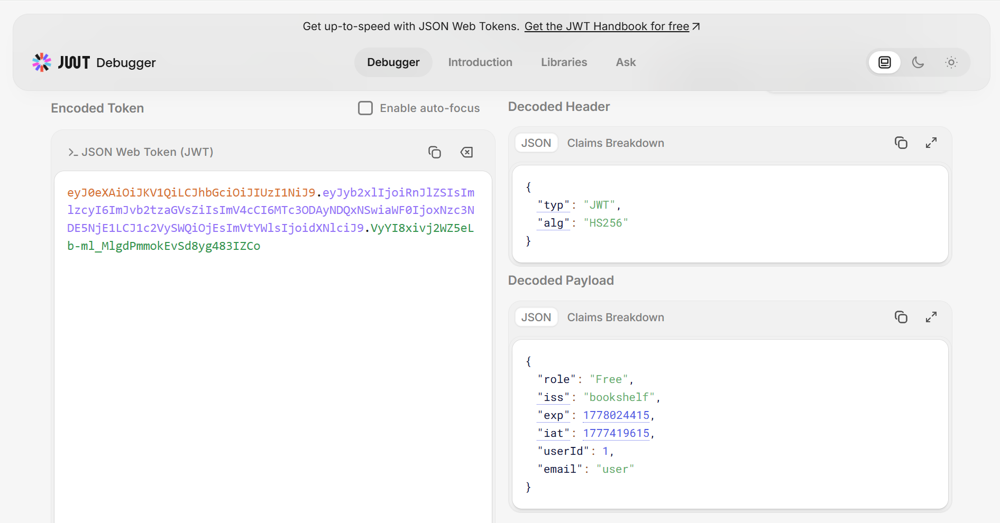
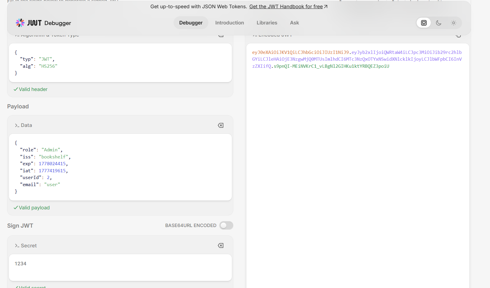

# picoCTF: Java Code Analysis!?!

## Context & Vulnerability
This code creates an extensive reading application where a user can read pdfs/books that they are given the jurisdiction to access. According to the challenge description, we need to read the 'Flag' book which is only accessible by a user with admin authority whereas the user account provided to us only has the free tier authority.

In the security folder of the challenge, specifically SecretGenerator.java, we have following code:
```
private String generateRandomString(int len) {
    // not so random
    return "1234";
}
```
This is clearly a security concern. The application uses JWT (JSON Web Tokens) to authenticate logins and the JWT code depends on this generateRandomString function for its secret key. Since the secret key that is used for authenticating a user is not secure, it is possible that a malicious user can gain access to another user's account.

## Background: JSON Web Tokens (JWT)
A JSON Web Token (JWT) is a method for securely transmitting information between two parties through a compact, URL-safe JSON object. It is primarily used for authentication and authorization.
A common example of JWT usage is authentication. In authentication, the user sends credentials to the server. The server verifies the credentials and creates a signed JWT that it returns to the client. In subsequent requests to protected resources that the client creates, this JWT is added to the header. The server can verify this JWT information to authorize the request is from a user with the sufficient privileges.

## Exploitation
JWT's auth-token and token-payload can be found in Applications > Local Storage through the Inspect tool. Using the website jwt.io (JWT Debugger), one can decode the string:



We can see that these are parameters for the user, including ones we're interested in like "role": "Free" and "userId": 1. 

When we read through the code of the BookShelfConfig.java in the configs folder, we find that the code initializes the user and admin users with user's id being 1 and admin being 2. On the website, we also notice that there are three roles: Free, Premium, and Admin. Our goal is to get to Admin.

Since the secret of the JWT was hard-coded as '1234', we can use that in the JWT Signature Verification section of jwt.io and encode the payload again, changing role to Admin and userId to 2. 




Using this payload and the new encoded JWT auth-token, we can replace the previous auth-token and token-payload.

Refreshing the page, we receive the flag:

picoCTF{w34k_jwt_n0t_g00d_d7c2e335}


## Remediation
The remediation is to actually generate a random string and complete the generateRandomString function rather than hard code the random string to 1234. In doing such, JWT can properly function and authenticate users.

## Resources
What is JWT? https://www.jwt.io/introduction 