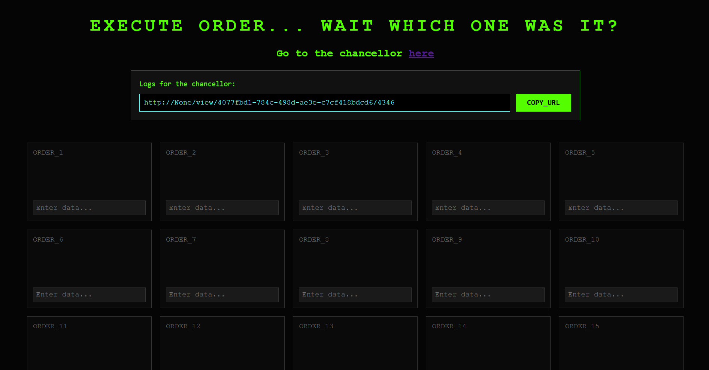
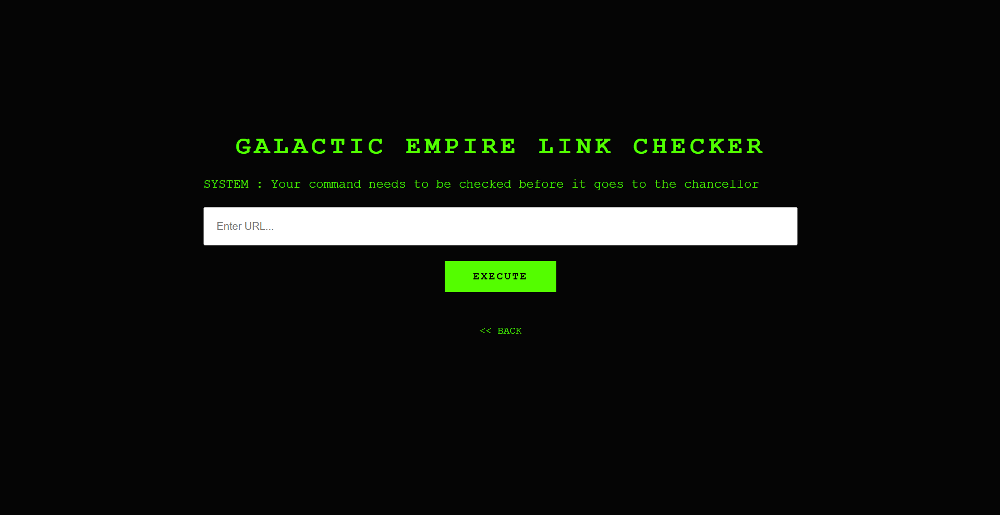
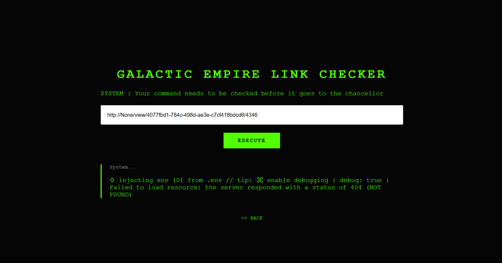
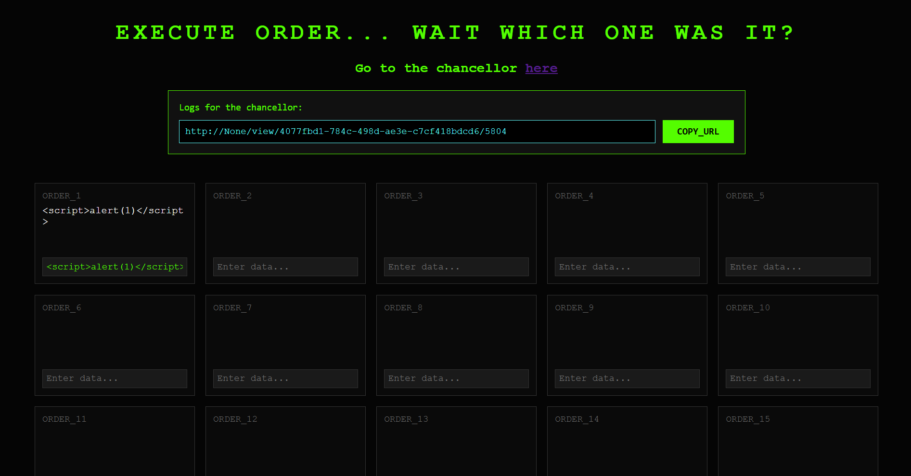

# UMass 2026: web/order66

## Context & Vulnerability
This is an application with 66 order boxes, a link 'Go to the chancellor' (admin), and a copyable url under the title 'Logs for chancellor'. From this premise and previous experience, we need to use the given url in some sort of way and paste it into the redirected page for the chancellor.





While testing out the site, you notice that you are limited to only inputting into one of the orders at a time. Additionally, regardless of the input, the link in the url box does not change. Trying to insert this link into the chancellor/admin gives an error. The chancellor/admin also does not take https, only http connections.



In the code, you notice that is_payload_present variable hints at the XSS solve. 

`is_payload_present = "<script" in current_content.lower() or "alert(" in current_content.lower()`

Our goal is the flag which is in the admin's cookie (see app.js). Notice how `secure` is set to `false` meaning the browser will transmit this cookie over http connections which is what the chancellor/admin takes.

```
await page.setCookie({
    name: 'flag',
    value: FLAG,
    domain: parsedUrl.hostname,
    path: '/',
    httpOnly: false,
    secure: false,
    sameSite: 'Lax'
});
```

## Exploitation
We notice from the `hello_word()` function that there is one vulnerable index `current_vuln_index` that means one of the 66 boxes allows for XSS with javascript. 

```
for i in range(1, 67):
    content = request.form.get(f'box_{i}')
    if content and i in submitted:
        db.set(f"{uid}:box_{i}", content)
        if i == current_vuln_index and ("<script" in content.lower() or "alert(" in content.lower()):
            is_payload_present = True
    else:
        db.delete(f"{uid}:box_{i}")
```

We see that the index, uid, and seed don't change when we enter into the order boxes, meaning that the vulnerable box doesn't change as we try different ord boxes. This means we can test each box to see which one is vulnerable with `<script>alert(1)</script>`.




The box that allows the alert to go through is the vulnerable box which we can inject with a payload we want the chancellor/admin to execute. We can use `<script>console.log(document.cookie)</script>` in order to dump the cookie into the output of the chancellor/admin.

For the chancellor to dump the flag, we need it to specifically visit and view the vulnerable order box. In app.py it has the api endpoint: `/view/<uid>/<int:seed>`
```
@app.route("/view/<uid>/<int:seed>")
def view_grid(uid, seed):
    grid_data, vuln_index = get_grid_context(uid, seed)
    return render_template('index.html', vuln_index=vuln_index, grid_data=grid_data, user_id=uid, seed=seed,host=host)
```
Since this gives direct access to the vulnerable box, we add these to the end of the chancellor logs so that the chancellor visits this specific endpoint. Doing so dumps the flag.

```
◇ injecting env (0) from .env // tip: ⌘ override existing { override: true }
flag=UMASS{m@7_t53_f0rce_b$_w!th_y8u}
Failed to load resource: the server responded with a status of 404 (NOT FOUND)
```

## Remediation
The easiest remediation for this scenario is setting `secure` equal to `true`. This ensures the cookie is only sent through encrypted connections (HTTPS rather than HTTP).

Another remediation would be to prevent XSS through checking inputs for javascript injections. Doing so will prevent the admin from executing unsafe injections when visiting the site url. Checks include sanitizing and encoding in order to make sure code is not executed.

A final and main remediation would be to keep all boxes secure. The deliberate creation of a vulnerable index or box for the sake of the challenge creates the main insecurity of the website.

